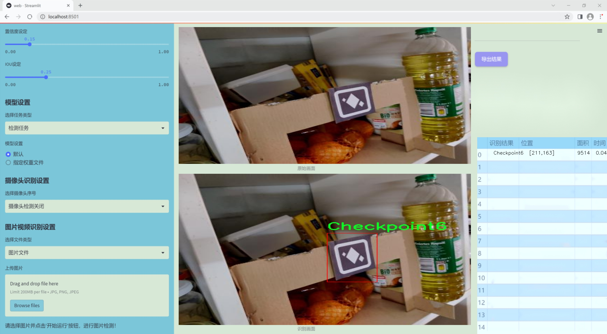

# 改进yolo11-DBB等200+全套创新点大全：靶标检测系统源码＆数据集全套

### 1.图片效果展示





##### 项目来源 **[人工智能促进会 2024.10.22](https://kdocs.cn/l/cszuIiCKVNis)**

##### 注意：由于项目一直在更新迭代，上面“1.图片效果展示”和“2.视频效果展示”展示的系统图片或者视频可能为老版本，新版本在老版本的基础上升级如下：（实际效果以升级的新版本为准）

  （1）适配了YOLOV11的“目标检测”模型和“实例分割”模型，通过加载相应的权重（.pt）文件即可自适应加载模型。

  （2）支持“图片识别”、“视频识别”、“摄像头实时识别”三种识别模式。

  （3）支持“图片识别”、“视频识别”、“摄像头实时识别”三种识别结果保存导出，解决手动导出（容易卡顿出现爆内存）存在的问题，识别完自动保存结果并导出到tempDir中。

  （4）支持Web前端系统中的标题、背景图等自定义修改。

  另外本项目提供训练的数据集和训练教程,暂不提供权重文件（best.pt）,需要您按照教程进行训练后实现图片演示和Web前端界面演示的效果。

### 2.视频效果展示

[2.1 视频效果展示](https://www.bilibili.com/video/BV1nqyRYGEUx/)

### 3.背景

研究背景与意义

随着计算机视觉技术的迅猛发展，目标检测在多个领域中扮演着越来越重要的角色，如自动驾驶、安防监控、工业自动化等。YOLO（You Only Look Once）系列模型因其高效的实时检测能力和较高的准确性，成为目标检测领域的研究热点。近年来，YOLOv11作为该系列的最新版本，进一步提升了检测精度和速度，为复杂场景下的目标识别提供了更为强大的技术支持。然而，尽管YOLOv11在许多标准数据集上表现出色，但在特定应用场景下，尤其是针对定制物体的检测，仍然存在一定的局限性。

本研究旨在基于改进的YOLOv11模型，构建一个针对特定靶标的检测系统。我们使用的数据集“Anki Vector Customobjectcodes”包含635张图像，涵盖了六个不同的类（Checkpoint1至Checkpoint6）。这些图像数据的多样性和复杂性为模型的训练和测试提供了良好的基础。通过对这些数据的深入分析和处理，我们希望能够提升YOLOv11在特定靶标检测中的性能，尤其是在低光照、遮挡及背景复杂等不利条件下的表现。

此外，本研究不仅有助于推动YOLOv11在定制化目标检测领域的应用，还将为相关行业提供实用的技术解决方案。通过改进的检测系统，能够有效提高目标识别的准确性和实时性，进而提升自动化系统的智能化水平。这对于推动智能设备的普及和应用，具有重要的理论价值和实际意义。

### 4.数据集信息展示

##### 4.1 本项目数据集详细数据（类别数＆类别名）

nc: 6
names: ['Checkpoint1', 'Checkpoint2', 'Checkpoint3', 'Checkpoint4', 'Checkpoint5', 'Checkpoint6']


该项目为【目标检测】数据集，请在【训练教程和Web端加载模型教程（第三步）】这一步的时候按照【目标检测】部分的教程来训练

##### 4.2 本项目数据集信息介绍

本项目数据集信息介绍

本项目采用的数据集名为“Anki Vector Customobjectcodes”，旨在为改进YOLOv11的靶标检测系统提供高质量的训练数据。该数据集包含六个类别，分别为“Checkpoint1”、“Checkpoint2”、“Checkpoint3”、“Checkpoint4”、“Checkpoint5”和“Checkpoint6”。这些类别代表了在特定环境中需要检测的不同目标，每个类别都经过精心标注，以确保模型在训练过程中能够学习到有效的特征。

数据集的构建过程注重多样性和代表性，确保所采集的图像涵盖了各种可能的场景和角度。这些图像不仅包含了目标的正面视图，还包括了不同光照条件、背景复杂度以及目标与背景的对比度变化，以增强模型的鲁棒性。此外，数据集中还包含了不同尺寸和位置的目标实例，旨在提高YOLOv11在实际应用中的检测精度和召回率。

为了进一步提升模型的泛化能力，数据集中的图像经过了多种数据增强处理，包括旋转、缩放、翻转等操作。这些增强技术能够有效扩展训练样本的多样性，使得模型在面对未见过的场景时，依然能够保持较高的检测性能。

在训练过程中，YOLOv11将利用“Anki Vector Customobjectcodes”数据集进行反复迭代学习，通过不断优化参数，提升其对六个靶标类别的识别能力。最终，期望通过本项目的数据集，构建出一个更加精确、高效的靶标检测系统，以满足实际应用中的需求。


### 5.全套项目环境部署视频教程（零基础手把手教学）

[5.1 所需软件PyCharm和Anaconda安装教程（第一步）](https://www.bilibili.com/video/BV1BoC1YCEKi/?spm_id_from=333.999.0.0&vd_source=bc9aec86d164b67a7004b996143742dc)


[5.2 安装Python虚拟环境创建和依赖库安装视频教程（第二步）](https://www.bilibili.com/video/BV1ZoC1YCEBw?spm_id_from=333.788.videopod.sections&vd_source=bc9aec86d164b67a7004b996143742dc)

### 6.改进YOLOv11训练教程和Web_UI前端加载模型教程（零基础手把手教学）

[6.1 改进YOLOv11训练教程和Web_UI前端加载模型教程（第三步）](https://www.bilibili.com/video/BV1BoC1YCEhR?spm_id_from=333.788.videopod.sections&vd_source=bc9aec86d164b67a7004b996143742dc)


按照上面的训练视频教程链接加载项目提供的数据集，运行train.py即可开始训练



     Epoch   gpu_mem       box       obj       cls    labels  img_size
     1/200     20.8G   0.01576   0.01955  0.007536        22      1280: 100%|██████████| 849/849 [14:42<00:00,  1.04s/it]
               Class     Images     Labels          P          R     mAP@.5 mAP@.5:.95: 100%|██████████| 213/213 [01:14<00:00,  2.87it/s]
                 all       3395      17314      0.994      0.957      0.0957      0.0843

     Epoch   gpu_mem       box       obj       cls    labels  img_size
     2/200     20.8G   0.01578   0.01923  0.007006        22      1280: 100%|██████████| 849/849 [14:44<00:00,  1.04s/it]
               Class     Images     Labels          P          R     mAP@.5 mAP@.5:.95: 100%|██████████| 213/213 [01:12<00:00,  2.95it/s]
                 all       3395      17314      0.996      0.956      0.0957      0.0845

     Epoch   gpu_mem       box       obj       cls    labels  img_size
     3/200     20.8G   0.01561    0.0191  0.006895        27      1280: 100%|██████████| 849/849 [10:56<00:00,  1.29it/s]
               Class     Images     Labels          P          R     mAP@.5 mAP@.5:.95: 100%|███████   | 187/213 [00:52<00:00,  4.04it/s]
                 all       3395      17314      0.996      0.957      0.0957      0.0845


###### [项目数据集下载链接](https://kdocs.cn/l/cszuIiCKVNis)

### 7.原始YOLOv11算法讲解

YOLOv11是一种由Ultralytics公司开发的最新一代目标检测模型，以其增强的特征提取能力和更高的效率在计算机视觉领域引人注目。该模型在架构上进行了关键升级，通过更新主干和颈部结构，显著提高了对复杂视觉场景的理解和处理精度。YOLOv11不仅在目标检测上表现出色，还支持实例分割、图像分类、姿态估计和定向目标检测（OBB）等任务，展示出其多功能性。

与其前身YOLOv8相比，YOLOv11在设计上实现了深度和宽度的改变，同时引入了几个创新机制。其中，C3k2机制是对YOLOv8中的C2f的改进，提升了浅层特征的处理能力；C2PSA机制则进一步优化了特征图的处理流程。解耦头的创新设计，通过增加两个深度卷积（DWConv），提高了模型对细节的感知能力和分类准确性。

在性能上，YOLOv11m模型在COCO数据集上的平均精度（mAP）提高，并减少了22%的参数量，确保了在运算效率上的突破。该模型可以部署在多种平台上，包括边缘设备、云平台以及支持NVIDIA GPU的系统，彰显出卓越的灵活性和适应性。总体而言，YOLOv11通过一系列的创新突破，对目标检测领域产生了深远的影响，并为未来的开发提供了新的研究方向。


****文档**** ： _ _https://docs.ultralytics.com/models/yolo11/__

****代码链接**** ： _ _https://github.com/ultralytics/ultralytics__

******Performance Metrics******


​ ** **关键特性****

****◆**** ** **增强的特征提取能力**** ：YOLO11采用了改进的主干和颈部架构，增强了 ** **特征提取****
能力，能够实现更精确的目标检测和复杂任务的执行。

****◆**** ** **优化的效率和速度****
：YOLO11引入了精细化的架构设计和优化的训练流程，提供更快的处理速度，并在准确性和性能之间保持最佳平衡。

****◆**** ** **参数更少、精度更高****
：通过模型设计的改进，YOLO11m在COCO数据集上实现了更高的平均精度（mAP），同时使用的参数比YOLOv8m少22%，使其在计算上更加高效，而不牺牲准确性。

****◆**** ** **跨环境的适应性**** ：YOLO11可以无缝部署在各种环境中，包括边缘设备、云平台和支持NVIDIA
GPU的系统，确保最大的灵活性。

****◆**** ** **支持广泛任务****
：无论是目标检测、实例分割、图像分类、姿态估计还是定向目标检测（OBB），YOLO11都旨在应对一系列计算机视觉挑战。

****支持的任务和模式****


​YOLO11建立在YOLOv8中引入的多功能模型范围之上，为各种计算机视觉任务提供增强的支持:


​该表提供了YOLO11模型变体的概述，展示了它们在特定任务中的适用性以及与Inference、Validation、Training和Export等操作模式的兼容性。从实时检测到复杂的分割任务
，这种灵活性使YOLO11适用于计算机视觉的广泛应用。

##### yolov11的创新

■ yolov8 VS yolov11

YOLOv5，YOLOv8和YOLOv11均是ultralytics公司的作品，ultralytics出品必属精品。


​ **具体创新点** ：

**① 深度（depth）和宽度 （width）**

YOLOv8和YOLOv11是基本上完全不同。

**② C3k2机制**

C3k2有参数为c3k，其中在网络的浅层c3k设置为False。C3k2就相当于YOLOv8中的C2f。


​ **③ C2PSA机制**

下图为C2PSA机制的原理图。


​ **④ 解耦头**

解耦头中的分类检测头增加了两个 **DWConv** 。


▲Conv

    
    
    def autopad(k, p=None, d=1):  # kernel, padding, dilation
    
        """Pad to 'same' shape outputs."""
    
        if d > 1:
    
            k = d * (k - 1) + 1 if isinstance(k, int) else [d * (x - 1) + 1 for x in k]  # actual kernel-size
    
        if p is None:
    
            p = k // 2 if isinstance(k, int) else [x // 2 for x in k]  # auto-pad
    
    return p
    
    
    class Conv(nn.Module):
    
        """Standard convolution with args(ch_in, ch_out, kernel, stride, padding, groups, dilation, activation)."""
    
    
        default_act = nn.SiLU()  # default activation
    
    
        def __init__(self, c1, c2, k=1, s=1, p=None, g=1, d=1, act=True):
    
            """Initialize Conv layer with given arguments including activation."""
    
            super().__init__()
    
            self.conv = nn.Conv2d(c1, c2, k, s, autopad(k, p, d), groups=g, dilation=d, bias=False)
    
            self.bn = nn.BatchNorm2d(c2)
    
            self.act = self.default_act if act is True else act if isinstance(act, nn.Module) else nn.Identity()
    
    
        def forward(self, x):
    
            """Apply convolution, batch normalization and activation to input tensor."""
    
            return self.act(self.bn(self.conv(x)))
    
    
        def forward_fuse(self, x):
    
            """Perform transposed convolution of 2D data."""
    
            return self.act(self.conv(x))

▲Conv2d

    
    
    torch.nn.Conv2d(in_channels, out_channels, kernel_size, stride=1, padding=0, dilation=1, groups=1, bias=True, padding_mode='zeros')

▲DWConv

DWConv ** **代表 Depthwise Convolution（深度卷积）****
，是一种在卷积神经网络中常用的高效卷积操作。它主要用于减少计算复杂度和参数量。

    
    
    class DWConv(Conv):
    
        """Depth-wise convolution."""
    
    
        def __init__(self, c1, c2, k=1, s=1, d=1, act=True):  # ch_in, ch_out, kernel, stride, dilation, activation
    
            """Initialize Depth-wise convolution with given parameters."""
    
            super().__init__(c1, c2, k, s, g=math.gcd(c1, c2), d=d, act=act)


### 8.200+种全套改进YOLOV11创新点原理讲解

#### 8.1 200+种全套改进YOLOV11创新点原理讲解大全

由于篇幅限制，每个创新点的具体原理讲解就不全部展开，具体见下列网址中的改进模块对应项目的技术原理博客网址【Blog】（创新点均为模块化搭建，原理适配YOLOv5~YOLOv11等各种版本）

[改进模块技术原理博客【Blog】网址链接](https://gitee.com/qunmasj/good)


#### 8.2 精选部分改进YOLOV11创新点原理讲解

###### 这里节选部分改进创新点展开原理讲解(完整的改进原理见上图和[改进模块技术原理博客链接](https://gitee.com/qunmasj/good)【如果此小节的图加载失败可以通过CSDN或者Github搜索该博客的标题访问原始博客，原始博客图片显示正常】

### AutoFocus: Efficient Multi-Scale Conv简介

参考该博客提出了AutoFocus，一种高效的多尺度目标检测算法。相较于以前对整个图像金字塔进行处理，该方法以一种由表及里的姿态，仅处理哪些整体上看来很有可能存在小物体的区域。这个可以通过预测一张类别未知的分割图FocusPixels来得到。为了高效利用FocusPixels，另外一个算法用于产生包含FocusPixels的FocusChips，这样可以减少计算量并处理更更精细的尺度。在不同尺度上FocusChips所得到的检测结果综合时，会出现问题，我们也提供了解决问题的方案。AutoFocus在COCO上的结果有49.7%mAP（50%重叠下68.3%），与多尺度baseline相仿但是快了2.5倍。金字塔中处理的像素数量减少了5倍mAP只下降1%，在与RetinaNet采用相同的ResNet-101结构且速度相同时，高了10%mAP。

人类寻找物体是一个动态的过程，且寻找时间与场景的复杂度是直接相关的。当我们的眼神在不同的点之间漂移时，其他的区域会被我们有意忽视。然而，现在的检测算法是一种静态的推理过程且图像金字塔中的每个像素都受到了一样的对待，这使得过程变得没有效率。现在许多的应用都不强调实时性，而计算上的节省其实可以产生很大收益。

在COCO数据集中，虽然40%的物体都是小物体，但是它们一共只占了全图的0.3%。如果金字塔是3倍关系，则在高分辨率层要进行9倍的运算。XXX 。那么有没有办法在低分辨率下找出可能含有这些物体的区域呢？

以人眼方案类比，我们可以从低分辨率图像开始，找出有可能存在物体的区域再“聚集”到高分辨率。我们的AutoFocus会在一层中计算小物体的分割图FocusPixels，而在每一个FocusPixels上会用一个算法产生下一层所需要关注的chips。在COCO的最大分辨率层上我们可以只处理**20%的像素而性能不下降，如果只处理5%**也只下降1%而已。


图像金字塔与卷积神经网络对CV十分重要。然而卷积神经网络无法做到对尺度不敏感，所以为了不同大小的物体需要依赖图像金字塔。虽然训练已经有了高效的方法，但是其推断时间依然远离实际使用标准。

目标检测加速有很长历史了。常用的有特征近似以减少尺度、级联、特征金字塔，且最后一个最近很多人研究。

AutoFocus为速度与精度之间提供了一个平滑的折衷，指出可以在低分辨率下看出小物体的所在，从而节约计算。FocusPixels的计算较为容易。

先简单介绍一下SNIP，是一种多尺度的训练、推断算法。主要思想是训练针对某个特定scale的检测器而不是scale-invariant检测器。这样训练样本就局限于在某个尺度范围内，以适于这个检测器处理。比如在高分辨率仅处理小物体而高分辨率仅处理大物体，其优势在于训练时不用考虑尺度的变化。

由于训练时物体大小是已知的，我们在图像金字塔中可以忽略大量区域而只处理物体周围的区域。SNIPER说明这样低分辨率的训练与全图训练相比并不会降低性能。同样，在推断过程中如果可以在大分辨率图像上预测可能出现小物体的chip，我们也就不用处理整张高分辨率图片。在训练时，许多物体会被裁剪、扭曲，这可以当作是一种数据扩增，然而当这个情况在推断时出现，则会产生错误，所以我们还需要一个算法来整合不同尺度上的检测结果。

#### AutoFocus框架
如SIFT、SURF等传统分类特征包含两个组件，一个detector和一个descriptor。detector只包含轻量级的操作如DoG、LoG，用于在整张图片上找到感兴趣的区域；descriptor，一般来说计算量比较大，则只需要关注那些咸兴趣的区域。这个级联结构保障了图片处理的效率。

同样，AutoFocus框架也是用于预测感兴趣的区域，并丢弃在下一尺度不可能存在物体的区域，并将裁剪和缩放后的区域传递给下一尺度。AutoFocus由三个部分组成：FocusPixels，FocusChips和focus stacking。

#### FocusPixels
FocusPixels定义在卷积网络特征图的粒度之上（如conv5），如果特征图上某个像素与小物体有重叠则标注为一个FocusPixel。（小物体：面积处于一个网络的输入范围之内）。训练过程中，FocusPixels标注为正，某些与不在面积范围内的物体有重叠的像素标注为无效，其他像素标注为负。AutoFocus的训练目标是使在FocusPixels区域产生较大的激活值。

如果同时多个物体与同一像素重叠，优先给正标注。我们的网络输入是512x512，然后a,b,c取值分别是5,64,90。对于太大或太小的物体，我们认为当前尺度上没有足够人信息进行判断，所以会标定为无效。整个网络结构如下图。训练时加两层带ReLU的卷积(3x3和1x1)以及一个二分类softmax来预测FocusPixels。


#### FocusChip生成
推断过程中，我们标注输出概率大于阈值t的像素（这个参数可以控制加速比），得到一些连通域。对于每一个域，我们做一次膨胀使其包含一些有助于识别的周围信息，膨胀后相连的部分要合并。然后，我们生成一些包含连通域的chips（不同chips可能重叠，如有重叠则合并）。有些chip可能太小缺少必要信息，并使chip的大小变化很大，为了效率我们要求保证一个最小的chip size。算法流程如下：


#### 级联推断过程
我们的过程类似于图片金字塔的推断过程但是在过程中一步步去除不关注的图片区域。我们在最低分辨率上进行检测并生成chips，然后在这些chips再进行检测和生成chips。

#### Focus Stacking
这种级联分类器的一个问题是在chip边缘本来的大物体可能生成一些被剪裁的检测目标。在下一个尺度上，由于剪裁过了，所以会检测到小的、错误的正例False Positive。之前算法中的第二步膨胀其实就是为了保证没有物体会出现在chip的边缘。这样，当我们在局部图片chip的边缘检测到物体时，就可以把这个检测结果丢弃，即使其在SNIP的范围内。

也有一些物体在图片边缘的特殊情况。如果chip和图片共享一条边的话，我们会检查检测结果的其他边是否完全在里面，如果在，则保留它，否则丢弃。

在每一尺度得到有效检测结果后，我们可以将不同尺度上的结果进行整合，将这些结果映射到原图坐标系上。最后，非极大值抑制NMS用于聚集。网络结构如之前的图片所示。


### 9.系统功能展示

图9.1.系统支持检测结果表格显示

  图9.2.系统支持置信度和IOU阈值手动调节

  图9.3.系统支持自定义加载权重文件best.pt(需要你通过步骤5中训练获得)

  图9.4.系统支持摄像头实时识别

  图9.5.系统支持图片识别

  图9.6.系统支持视频识别

  图9.7.系统支持识别结果文件自动保存

  图9.8.系统支持Excel导出检测结果数据


### 10. YOLOv11核心改进源码讲解

#### 10.1 conv.py

以下是经过简化和注释的核心代码部分，保留了主要的卷积模块和注意力机制的实现：

```python
import math
import torch
import torch.nn as nn

def autopad(k, p=None, d=1):
    """自动计算填充以保持输出形状相同。"""
    if d > 1:
        k = d * (k - 1) + 1 if isinstance(k, int) else [d * (x - 1) + 1 for x in k]  # 实际的卷积核大小
    if p is None:
        p = k // 2 if isinstance(k, int) else [x // 2 for x in k]  # 自动填充
    return p

class Conv(nn.Module):
    """标准卷积层，包含卷积、批归一化和激活函数。"""

    default_act = nn.SiLU()  # 默认激活函数

    def __init__(self, c1, c2, k=1, s=1, p=None, g=1, d=1, act=True):
        """初始化卷积层。"""
        super().__init__()
        self.conv = nn.Conv2d(c1, c2, k, s, autopad(k, p, d), groups=g, dilation=d, bias=False)
        self.bn = nn.BatchNorm2d(c2)  # 批归一化
        self.act = self.default_act if act is True else act if isinstance(act, nn.Module) else nn.Identity()

    def forward(self, x):
        """前向传播：卷积 -> 批归一化 -> 激活函数。"""
        return self.act(self.bn(self.conv(x)))

class DWConv(Conv):
    """深度可分离卷积。"""

    def __init__(self, c1, c2, k=1, s=1, d=1, act=True):
        """初始化深度卷积。"""
        super().__init__(c1, c2, k, s, g=math.gcd(c1, c2), d=d, act=act)

class DSConv(nn.Module):
    """深度可分离卷积模块。"""

    def __init__(self, c1, c2, k=1, s=1, d=1, act=True):
        super().__init__()
        self.dwconv = DWConv(c1, c1, 3)  # 深度卷积
        self.pwconv = Conv(c1, c2, 1)  # 点卷积

    def forward(self, x):
        """前向传播：深度卷积 -> 点卷积。"""
        return self.pwconv(self.dwconv(x))

class ChannelAttention(nn.Module):
    """通道注意力模块。"""

    def __init__(self, channels: int):
        """初始化通道注意力模块。"""
        super().__init__()
        self.pool = nn.AdaptiveAvgPool2d(1)  # 自适应平均池化
        self.fc = nn.Conv2d(channels, channels, 1, 1, 0, bias=True)  # 1x1卷积
        self.act = nn.Sigmoid()  # Sigmoid激活

    def forward(self, x: torch.Tensor) -> torch.Tensor:
        """前向传播：通道注意力计算。"""
        return x * self.act(self.fc(self.pool(x)))  # 输入乘以注意力权重

class SpatialAttention(nn.Module):
    """空间注意力模块。"""

    def __init__(self, kernel_size=7):
        """初始化空间注意力模块。"""
        super().__init__()
        assert kernel_size in {3, 7}, "kernel size must be 3 or 7"
        padding = 3 if kernel_size == 7 else 1
        self.cv1 = nn.Conv2d(2, 1, kernel_size, padding=padding, bias=False)  # 卷积层
        self.act = nn.Sigmoid()  # Sigmoid激活

    def forward(self, x):
        """前向传播：空间注意力计算。"""
        return x * self.act(self.cv1(torch.cat([torch.mean(x, 1, keepdim=True), torch.max(x, 1, keepdim=True)[0]], 1)))

class CBAM(nn.Module):
    """卷积块注意力模块。"""

    def __init__(self, c1, kernel_size=7):
        """初始化CBAM模块。"""
        super().__init__()
        self.channel_attention = ChannelAttention(c1)  # 通道注意力
        self.spatial_attention = SpatialAttention(kernel_size)  # 空间注意力

    def forward(self, x):
        """前向传播：通过CBAM模块。"""
        return self.spatial_attention(self.channel_attention(x))  # 先通道注意力，再空间注意力
```

### 代码说明：
1. **自动填充函数 (`autopad`)**：根据卷积核大小和膨胀率自动计算填充，以保持输出的空间维度与输入相同。
2. **卷积类 (`Conv`)**：实现了标准的卷积操作，包含卷积、批归一化和激活函数。
3. **深度卷积类 (`DWConv`)**：继承自 `Conv`，实现深度卷积，适用于深度可分离卷积。
4. **深度可分离卷积类 (`DSConv`)**：组合了深度卷积和点卷积的操作。
5. **通道注意力模块 (`ChannelAttention`)**：通过自适应平均池化和1x1卷积计算通道注意力。
6. **空间注意力模块 (`SpatialAttention`)**：通过对输入的均值和最大值进行卷积计算空间注意力。
7. **CBAM模块 (`CBAM`)**：结合通道和空间注意力的模块，先计算通道注意力，再计算空间注意力。

这些模块在深度学习模型中广泛应用，尤其是在计算机视觉任务中。

这个文件 `conv.py` 定义了一系列用于卷积操作的模块，主要用于深度学习中的卷积神经网络（CNN）。文件中包含了多种卷积层的实现，旨在提高模型的灵活性和性能。

首先，文件导入了必要的库，包括 `math`、`numpy` 和 `torch`，并定义了一个包含所有导出类名的元组 `__all__`，以便在使用 `from conv import *` 时能够正确导入。

接下来，定义了一个辅助函数 `autopad`，用于自动计算卷积操作的填充，以确保输出的形状与输入相同。这个函数根据给定的卷积核大小、填充和扩张因子来计算填充的大小。

然后，定义了多个卷积相关的类。`Conv` 类是一个标准的卷积层，包含卷积操作、批归一化和激活函数。它的构造函数接收多个参数，如输入通道数、输出通道数、卷积核大小、步幅、填充、分组数、扩张因子以及是否使用激活函数。`forward` 方法执行卷积、批归一化和激活的操作。

`Conv2` 类是对 `Conv` 类的简化版本，增加了一个 1x1 的卷积层，并在前向传播中将两个卷积的输出相加。它还提供了 `fuse_convs` 方法，用于将两个卷积层融合为一个，以提高计算效率。

`LightConv` 类实现了一种轻量级卷积，包含两个卷积层，其中一个是深度卷积（`DWConv`），用于减少参数量和计算量。

`DWConv` 类实现了深度卷积，允许每个输入通道单独进行卷积操作。`DSConv` 类则实现了深度可分离卷积，它将深度卷积和逐点卷积结合在一起，以进一步减少计算复杂度。

`DWConvTranspose2d` 类实现了深度转置卷积，`ConvTranspose` 类则实现了标准的转置卷积层，支持批归一化和激活函数。

`Focus` 类用于将输入的空间信息集中到通道维度，`GhostConv` 类实现了一种高效的“幽灵卷积”，通过组合主要和廉价的操作来学习特征。

`RepConv` 类实现了一种重复卷积模块，支持训练和推理阶段的不同操作，能够在推理时将多个卷积层融合为一个。

此外，文件中还定义了几个注意力机制模块，包括 `ChannelAttention` 和 `SpatialAttention`，用于在特征图中重新校准通道和空间信息。`CBAM` 类则结合了这两种注意力机制。

最后，`Concat` 类用于在指定维度上连接多个张量，方便在网络中进行特征的组合。

总体而言，这个文件实现了多种卷积和注意力机制的模块，旨在为构建高效的卷积神经网络提供灵活的组件。

#### 10.2 kagn_conv.py

以下是代码中最核心的部分，并附上详细的中文注释：

```python
import torch
import torch.nn as nn
from functools import lru_cache

class KAGNConvNDLayer(nn.Module):
    def __init__(self, conv_class, norm_class, conv_w_fun, input_dim, output_dim, degree, kernel_size,
                 groups=1, padding=0, stride=1, dilation=1, dropout: float = 0.0, ndim: int = 2):
        super(KAGNConvNDLayer, self).__init__()
        
        # 初始化参数
        self.inputdim = input_dim  # 输入维度
        self.outdim = output_dim    # 输出维度
        self.degree = degree         # 多项式的阶数
        self.kernel_size = kernel_size  # 卷积核大小
        self.padding = padding       # 填充
        self.stride = stride         # 步幅
        self.dilation = dilation     # 膨胀
        self.groups = groups         # 分组卷积的组数
        self.base_activation = nn.SiLU()  # 基础激活函数
        self.conv_w_fun = conv_w_fun  # 卷积权重函数
        self.ndim = ndim             # 数据的维度（1D, 2D, 3D）
        self.dropout = None          # Dropout层

        # 如果dropout大于0，则根据维度选择相应的Dropout层
        if dropout > 0:
            if ndim == 1:
                self.dropout = nn.Dropout1d(p=dropout)
            elif ndim == 2:
                self.dropout = nn.Dropout2d(p=dropout)
            elif ndim == 3:
                self.dropout = nn.Dropout3d(p=dropout)

        # 验证分组卷积的参数
        if groups <= 0:
            raise ValueError('groups must be a positive integer')
        if input_dim % groups != 0:
            raise ValueError('input_dim must be divisible by groups')
        if output_dim % groups != 0:
            raise ValueError('output_dim must be divisible by groups')

        # 创建基础卷积层和归一化层
        self.base_conv = nn.ModuleList([conv_class(input_dim // groups,
                                                   output_dim // groups,
                                                   kernel_size,
                                                   stride,
                                                   padding,
                                                   dilation,
                                                   groups=1,
                                                   bias=False) for _ in range(groups)])

        self.layer_norm = nn.ModuleList([norm_class(output_dim // groups) for _ in range(groups)])

        # 多项式权重的形状
        poly_shape = (groups, output_dim // groups, (input_dim // groups) * (degree + 1)) + tuple(
            kernel_size for _ in range(ndim))

        # 初始化多项式权重和beta权重
        self.poly_weights = nn.Parameter(torch.randn(*poly_shape))
        self.beta_weights = nn.Parameter(torch.zeros(degree + 1, dtype=torch.float32))

        # 使用Kaiming均匀分布初始化卷积层的权重
        for conv_layer in self.base_conv:
            nn.init.kaiming_uniform_(conv_layer.weight, nonlinearity='linear')

        nn.init.kaiming_uniform_(self.poly_weights, nonlinearity='linear')
        nn.init.normal_(
            self.beta_weights,
            mean=0.0,
            std=1.0 / ((kernel_size ** ndim) * self.inputdim * (self.degree + 1.0)),
        )

    def beta(self, n, m):
        # 计算beta值，用于Legendre多项式的计算
        return (
            ((m + n) * (m - n) * n ** 2) / (m ** 2 / (4.0 * n ** 2 - 1.0))
        ) * self.beta_weights[n]

    @lru_cache(maxsize=128)  # 使用缓存避免重复计算Legendre多项式
    def gram_poly(self, x, degree):
        # 计算Legendre多项式
        p0 = x.new_ones(x.size())  # P0 = 1

        if degree == 0:
            return p0.unsqueeze(-1)

        p1 = x  # P1 = x
        grams_basis = [p0, p1]

        for i in range(2, degree + 1):
            p2 = x * p1 - self.beta(i - 1, i) * p0  # 递归计算多项式
            grams_basis.append(p2)
            p0, p1 = p1, p2

        return torch.cat(grams_basis, dim=1)  # 将所有多项式连接在一起

    def forward_kag(self, x, group_index):
        # 对输入进行基础激活并进行线性变换
        basis = self.base_conv[group_index](self.base_activation(x))

        # 将x归一化到[-1, 1]范围内，以便进行稳定的Legendre多项式计算
        x = torch.tanh(x).contiguous()

        if self.dropout is not None:
            x = self.dropout(x)  # 应用Dropout

        grams_basis = self.base_activation(self.gram_poly(x, self.degree))  # 计算Gram多项式基

        # 使用卷积权重函数进行卷积操作
        y = self.conv_w_fun(grams_basis, self.poly_weights[group_index],
                            stride=self.stride, dilation=self.dilation,
                            padding=self.padding, groups=1)

        # 通过归一化层和激活函数处理输出
        y = self.base_activation(self.layer_norm[group_index](y + basis))

        return y

    def forward(self, x):
        # 前向传播
        split_x = torch.split(x, self.inputdim // self.groups, dim=1)  # 按组分割输入
        output = []
        for group_ind, _x in enumerate(split_x):
            y = self.forward_kag(_x.clone(), group_ind)  # 对每个组进行前向传播
            output.append(y.clone())
        y = torch.cat(output, dim=1)  # 将所有组的输出连接在一起
        return y
```

### 代码说明：
1. **KAGNConvNDLayer**: 这是一个自定义的卷积层，支持任意维度的卷积（1D, 2D, 3D），并结合了Legendre多项式的计算。
2. **参数初始化**: 在构造函数中，初始化了卷积层、归一化层和多项式权重，并进行了相应的权重初始化。
3. **beta函数**: 计算Legendre多项式所需的beta值。
4. **gram_poly函数**: 计算给定阶数的Legendre多项式，并将其结果以张量的形式返回。
5. **forward_kag函数**: 实现了前向传播的具体逻辑，包括基础激活、Gram多项式计算和卷积操作。
6. **forward函数**: 处理输入数据的前向传播，将输入按组分割并分别处理，最后将结果连接起来。

这个程序文件 `kagn_conv.py` 定义了一个名为 `KAGNConvNDLayer` 的神经网络层，以及其一维、二维和三维的具体实现类 `KAGNConv1DLayer`、`KAGNConv2DLayer` 和 `KAGNConv3DLayer`。该层的设计灵感来源于一种特殊的卷积结构，结合了多项式基函数和标准卷积操作，旨在提高神经网络的表达能力。

首先，`KAGNConvNDLayer` 类是一个通用的多维卷积层，其构造函数接受多个参数，包括输入和输出维度、卷积核大小、分组数、填充、步幅、扩张率、丢弃率等。该类内部首先初始化了一些基本参数，并根据输入的维度和分组数创建多个卷积层和归一化层。卷积层使用的是指定的卷积类（如 `nn.Conv1d`、`nn.Conv2d` 或 `nn.Conv3d`），而归一化层则使用指定的归一化类（如 `nn.InstanceNorm1d`、`nn.InstanceNorm2d` 或 `nn.InstanceNorm3d`）。

在初始化过程中，程序还创建了多项式权重和β权重，并使用 Kaiming 均匀分布对这些权重进行初始化，以便在训练开始时提供更好的性能。多项式权重的形状由分组数、输出维度和输入维度等参数决定。

该类的核心功能在于 `forward` 方法，它负责前向传播。在这个方法中，输入张量 `x` 被分割成多个组，然后对每个组分别进行处理。每个组的处理过程通过 `forward_kag` 方法完成，该方法首先对输入应用基本激活函数，然后进行卷积操作，接着计算 Legendre 多项式基，并将其与多项式权重结合进行卷积，最后通过归一化层和激活函数生成输出。

`KAGNConv3DLayer`、`KAGNConv2DLayer` 和 `KAGNConv1DLayer` 类分别继承自 `KAGNConvNDLayer`，并在构造函数中指定了对应的卷积和归一化类。这使得用户可以方便地创建一维、二维或三维的 KAGN 卷积层，适应不同类型的数据输入。

总的来说，这个程序文件实现了一种灵活且功能强大的卷积层，能够在多种维度上处理数据，并结合了多项式基函数的特性，以增强模型的学习能力。

#### 10.3 repvit.py

以下是经过简化和注释的核心代码部分：

```python
import torch
import torch.nn as nn
from timm.models.layers import SqueezeExcite

def _make_divisible(v, divisor, min_value=None):
    """
    确保通道数是8的倍数，避免模型不兼容。
    :param v: 输入的通道数
    :param divisor: 除数，通常为8
    :param min_value: 最小值，默认为divisor
    :return: 处理后的通道数
    """
    if min_value is None:
        min_value = divisor
    new_v = max(min_value, int(v + divisor / 2) // divisor * divisor)
    # 确保向下取整不会减少超过10%
    if new_v < 0.9 * v:
        new_v += divisor
    return new_v

class Conv2d_BN(nn.Sequential):
    """
    包含卷积层和批归一化层的模块
    """
    def __init__(self, in_channels, out_channels, kernel_size=1, stride=1, padding=0, dilation=1, groups=1):
        super().__init__()
        # 添加卷积层
        self.add_module('conv', nn.Conv2d(in_channels, out_channels, kernel_size, stride, padding, dilation, groups, bias=False))
        # 添加批归一化层
        self.add_module('bn', nn.BatchNorm2d(out_channels))

    @torch.no_grad()
    def fuse_self(self):
        """
        将卷积层和批归一化层融合为一个卷积层，以提高推理速度
        """
        conv, bn = self._modules.values()
        # 计算融合后的权重和偏置
        w = bn.weight / (bn.running_var + bn.eps)**0.5
        w = conv.weight * w[:, None, None, None]
        b = bn.bias + (conv.bias - bn.running_mean) * bn.weight / (bn.running_var + bn.eps)**0.5
        # 创建新的卷积层
        fused_conv = nn.Conv2d(w.size(1) * conv.groups, w.size(0), w.shape[2:], stride=conv.stride, padding=conv.padding, dilation=conv.dilation, groups=conv.groups)
        fused_conv.weight.data.copy_(w)
        fused_conv.bias.data.copy_(b)
        return fused_conv

class RepViTBlock(nn.Module):
    """
    RepViT的基本块，包含通道混合和标记混合
    """
    def __init__(self, inp, hidden_dim, oup, kernel_size, stride, use_se, use_hs):
        super(RepViTBlock, self).__init__()
        self.identity = stride == 1 and inp == oup
        assert(hidden_dim == 2 * inp)

        if stride == 2:
            # 当步幅为2时，使用卷积和SE模块
            self.token_mixer = nn.Sequential(
                Conv2d_BN(inp, inp, kernel_size, stride, (kernel_size - 1) // 2, groups=inp),
                SqueezeExcite(inp, 0.25) if use_se else nn.Identity(),
                Conv2d_BN(inp, oup, ks=1, stride=1, pad=0)
            )
            self.channel_mixer = nn.Sequential(
                Conv2d_BN(oup, 2 * oup, 1, 1, 0),
                nn.GELU() if use_hs else nn.Identity(),
                Conv2d_BN(2 * oup, oup, 1, 1, 0)
            )
        else:
            assert(self.identity)
            # 当步幅为1时，使用RepVGGDW模块
            self.token_mixer = nn.Sequential(
                RepVGGDW(inp),
                SqueezeExcite(inp, 0.25) if use_se else nn.Identity(),
            )
            self.channel_mixer = nn.Sequential(
                Conv2d_BN(inp, hidden_dim, 1, 1, 0),
                nn.GELU() if use_hs else nn.Identity(),
                Conv2d_BN(hidden_dim, oup, 1, 1, 0)
            )

    def forward(self, x):
        return self.channel_mixer(self.token_mixer(x))

class RepViT(nn.Module):
    """
    RepViT模型的实现
    """
    def __init__(self, cfgs):
        super(RepViT, self).__init__()
        self.cfgs = cfgs
        input_channel = self.cfgs[0][2]
        # 构建初始层
        patch_embed = nn.Sequential(Conv2d_BN(3, input_channel // 2, 3, 2, 1), nn.GELU(),
                                     Conv2d_BN(input_channel // 2, input_channel, 3, 2, 1))
        layers = [patch_embed]
        # 构建RepViT块
        for k, t, c, use_se, use_hs, s in self.cfgs:
            output_channel = _make_divisible(c, 8)
            exp_size = _make_divisible(input_channel * t, 8)
            layers.append(RepViTBlock(input_channel, exp_size, output_channel, k, s, use_se, use_hs))
            input_channel = output_channel
        self.features = nn.ModuleList(layers)

    def forward(self, x):
        for f in self.features:
            x = f(x)
        return x

def repvit_m0_9(weights=''):
    """
    构建RepViT模型的一个变体
    """
    cfgs = [
        # k, t, c, SE, HS, s 
        [3, 2, 48, 1, 0, 1],
        # 其他配置...
    ]
    model = RepViT(cfgs)
    if weights:
        model.load_state_dict(torch.load(weights)['model'])
    return model

# 示例代码
if __name__ == '__main__':
    model = repvit_m0_9()
    inputs = torch.randn((1, 3, 640, 640))
    res = model(inputs)
    print(res.size())
```

### 代码说明：
1. **_make_divisible**: 确保通道数是8的倍数，以便于模型的兼容性。
2. **Conv2d_BN**: 这是一个组合模块，包含卷积层和批归一化层，并提供了融合功能以提高推理速度。
3. **RepViTBlock**: 这是RepViT模型的基本构建块，负责通道混合和标记混合的操作。
4. **RepViT**: 这是整个RepViT模型的实现，负责根据配置构建模型的各个层。
5. **repvit_m0_9**: 这是一个构建特定变体模型的函数，允许加载预训练权重。

以上代码保留了模型的核心结构和功能，并进行了详细的中文注释。

这个程序文件 `repvit.py` 实现了一个基于深度学习的模型，主要用于图像处理任务。该模型的结构灵感来源于 MobileNet 和 Vision Transformer（ViT），结合了卷积神经网络（CNN）和注意力机制。以下是对代码的详细说明。

首先，程序导入了必要的库，包括 PyTorch、NumPy 和 timm 库中的 SqueezeExcite 层。接着，定义了一个 `replace_batchnorm` 函数，用于替换模型中的 BatchNorm 层为 Identity 层，这通常是在模型推理阶段进行的优化，以提高推理速度。

接下来，定义了一个 `_make_divisible` 函数，该函数确保模型的每一层的通道数都是 8 的倍数，这是为了适应某些硬件加速器的要求。

然后，定义了一个 `Conv2d_BN` 类，继承自 `torch.nn.Sequential`，该类结合了卷积层和 BatchNorm 层，并在初始化时对 BatchNorm 的权重进行了初始化。该类还实现了一个 `fuse_self` 方法，用于将卷积层和 BatchNorm 层融合为一个卷积层，以减少计算量。

接着，定义了一个 `Residual` 类，用于实现残差连接。该类在前向传播中将输入与经过卷积处理的输出相加，支持随机丢弃（dropout）以增强模型的鲁棒性。

`RepVGGDW` 类实现了一种特殊的卷积结构，结合了深度可分离卷积和残差连接，具有良好的特征提取能力。

`RepViTBlock` 类是模型的基本构建块，包含了 token mixer 和 channel mixer 两部分。token mixer 负责处理空间信息，而 channel mixer 则负责处理通道信息。根据步幅的不同，该类的结构也有所不同。

`RepViT` 类是整个模型的主体，负责构建模型的各个层。它接受一个配置列表 `cfgs`，根据该配置逐层构建模型。模型的前向传播方法返回特征图，便于后续处理。

在文件的最后部分，定义了一些函数，如 `update_weight` 用于更新模型的权重，`repvit_m0_9`、`repvit_m1_0` 等函数用于构建不同版本的 RepViT 模型，并加载相应的预训练权重。

在 `if __name__ == '__main__':` 语句中，程序创建了一个 `repvit_m2_3` 模型实例，并生成了一组随机输入数据，经过模型处理后输出特征图的尺寸。

总体来说，这个程序实现了一个灵活且高效的图像处理模型，适用于各种计算机视觉任务。通过对模型结构的精心设计和优化，能够在保证性能的同时提高推理速度。

#### 10.4 mobilenetv4.py

以下是保留的核心代码部分，并附上详细的中文注释：

```python
import torch
import torch.nn as nn

# 定义构建不同版本MobileNetV4的基本参数
MODEL_SPECS = {
    "MobileNetV4ConvSmall": {
        "conv0": {
            "block_name": "convbn",
            "num_blocks": 1,
            "block_specs": [
                [3, 32, 3, 2]  # 输入通道3，输出通道32，卷积核大小3，步幅2
            ]
        },
        # 其他层的参数省略...
    },
    # 其他模型的参数省略...
}

def conv_2d(inp, oup, kernel_size=3, stride=1, groups=1, bias=False, norm=True, act=True):
    """
    创建一个2D卷积层，包含卷积、批归一化和激活函数。
    
    Args:
        inp: 输入通道数
        oup: 输出通道数
        kernel_size: 卷积核大小
        stride: 步幅
        groups: 分组卷积的组数
        bias: 是否使用偏置
        norm: 是否使用批归一化
        act: 是否使用激活函数
    
    Returns:
        包含卷积层、批归一化和激活函数的序列模块
    """
    conv = nn.Sequential()
    padding = (kernel_size - 1) // 2  # 计算填充
    conv.add_module('conv', nn.Conv2d(inp, oup, kernel_size, stride, padding, bias=bias, groups=groups))
    if norm:
        conv.add_module('BatchNorm2d', nn.BatchNorm2d(oup))  # 添加批归一化
    if act:
        conv.add_module('Activation', nn.ReLU6())  # 添加ReLU6激活函数
    return conv

class InvertedResidual(nn.Module):
    """
    反向残差块，包含扩展卷积和深度卷积。
    """
    def __init__(self, inp, oup, stride, expand_ratio, act=False):
        super(InvertedResidual, self).__init__()
        self.stride = stride
        hidden_dim = int(round(inp * expand_ratio))  # 计算隐藏层的通道数
        self.block = nn.Sequential()
        if expand_ratio != 1:
            self.block.add_module('exp_1x1', conv_2d(inp, hidden_dim, kernel_size=1, stride=1))  # 扩展卷积
        self.block.add_module('conv_3x3', conv_2d(hidden_dim, hidden_dim, kernel_size=3, stride=stride, groups=hidden_dim))  # 深度卷积
        self.block.add_module('red_1x1', conv_2d(hidden_dim, oup, kernel_size=1, stride=1, act=act))  # 投影卷积
        self.use_res_connect = self.stride == 1 and inp == oup  # 判断是否使用残差连接

    def forward(self, x):
        if self.use_res_connect:
            return x + self.block(x)  # 使用残差连接
        else:
            return self.block(x)

class MobileNetV4(nn.Module):
    """
    MobileNetV4模型类，构建不同版本的MobileNetV4网络。
    """
    def __init__(self, model):
        super().__init__()
        assert model in MODEL_SPECS.keys()  # 确保模型名称有效
        self.model = model
        self.spec = MODEL_SPECS[self.model]
       
        # 根据模型规格构建各层
        self.conv0 = build_blocks(self.spec['conv0'])
        self.layer1 = build_blocks(self.spec['layer1'])
        self.layer2 = build_blocks(self.spec['layer2'])
        self.layer3 = build_blocks(self.spec['layer3'])
        self.layer4 = build_blocks(self.spec['layer4'])
        self.layer5 = build_blocks(self.spec['layer5'])
        self.features = nn.ModuleList([self.conv0, self.layer1, self.layer2, self.layer3, self.layer4, self.layer5])     

    def forward(self, x):
        """
        前向传播，返回特征图。
        """
        features = [None, None, None, None]
        for f in self.features:
            x = f(x)  # 通过每一层
            # 根据输入大小选择特征图
            if x.size(2) in [x.size(2) // 4, x.size(2) // 8, x.size(2) // 16, x.size(2) // 32]:
                features.append(x)
        return features

# 定义不同版本的MobileNetV4构造函数
def MobileNetV4ConvSmall():
    return MobileNetV4('MobileNetV4ConvSmall')

# 主程序
if __name__ == '__main__':
    model = MobileNetV4ConvSmall()  # 创建MobileNetV4ConvSmall模型
    inputs = torch.randn((1, 3, 640, 640))  # 随机输入
    res = model(inputs)  # 前向传播
    for i in res:
        print(i.size())  # 输出每个特征图的大小
```

### 代码说明：
1. **模型参数定义**：使用字典定义不同版本的MobileNetV4的结构参数。
2. **卷积层构建**：`conv_2d`函数创建一个包含卷积、批归一化和激活函数的序列模块。
3. **反向残差块**：`InvertedResidual`类实现了MobileNetV4中的反向残差块，支持扩展卷积和深度卷积。
4. **MobileNetV4模型**：`MobileNetV4`类根据输入的模型名称构建相应的网络结构，并实现前向传播。
5. **模型实例化**：在主程序中实例化`MobileNetV4ConvSmall`模型，并进行前向传播以输出特征图的大小。

这个程序文件实现了 MobileNetV4 模型的构建，主要用于深度学习中的图像分类任务。程序首先导入了必要的库，包括 PyTorch 的核心库和神经网络模块。接着定义了一些模型的结构参数，这些参数包括不同版本的 MobileNetV4 模型的各个层的配置。

在代码中，`MNV4ConvSmall_BLOCK_SPECS`、`MNV4ConvMedium_BLOCK_SPECS` 和 `MNV4ConvLarge_BLOCK_SPECS` 等字典定义了不同规模的 MobileNetV4 模型的层级结构。每个字典包含了多个层的配置，每一层的配置又包括了层的类型、数量和具体的参数（如输入输出通道数、卷积核大小、步幅等）。

`make_divisible` 函数用于确保所有层的通道数都是 8 的倍数，以便于模型的优化和加速。`conv_2d` 函数是一个辅助函数，用于构建带有卷积、批归一化和激活函数的序列模块。

`InvertedResidual` 类实现了反向残差块，这是 MobileNetV4 的核心构建块之一。它通过深度可分离卷积来减少计算量，同时保留重要的特征信息。`UniversalInvertedBottleneckBlock` 类则实现了一个更通用的反向瓶颈块，支持不同的卷积核大小和下采样。

`build_blocks` 函数根据层的配置构建相应的网络层，支持不同类型的块（如 `convbn`、`uib` 和 `fused_ib`）。`MobileNetV4` 类是整个模型的主体，它根据传入的模型名称构建相应的网络结构，并定义了前向传播的方法。

在 `__init__` 方法中，模型的各个层被依次构建并存储在 `self.features` 中。`forward` 方法实现了模型的前向传播逻辑，并在输入尺寸的不同缩放下提取特征。

最后，文件中定义了一些函数（如 `MobileNetV4ConvSmall`、`MobileNetV4ConvMedium` 等）用于创建不同版本的 MobileNetV4 模型。在主程序中，创建了一个 `MobileNetV4ConvSmall` 模型并对随机生成的输入进行了前向传播，输出了各层的特征图尺寸。

总体来说，这个程序文件提供了一个灵活且高效的方式来构建和使用 MobileNetV4 模型，适用于各种深度学习任务。

注意：由于此博客编辑较早，上面“10.YOLOv11核心改进源码讲解”中部分代码可能会优化升级，仅供参考学习，以“11.完整训练+Web前端界面+200+种全套创新点源码、数据集获取”的内容为准。

### 11.完整训练+Web前端界面+200+种全套创新点源码、数据集获取


# [下载链接：https://mbd.pub/o/bread/Zp2bmJ9t](https://mbd.pub/o/bread/Zp2bmJ9t)